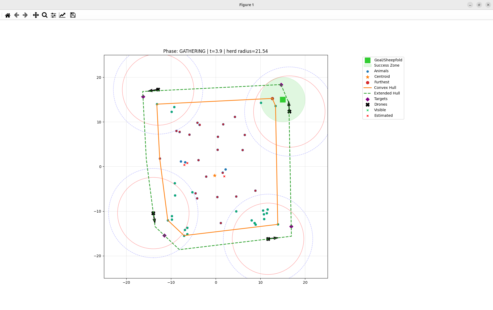
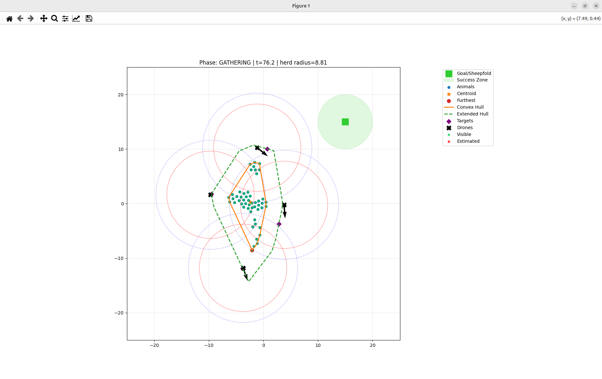
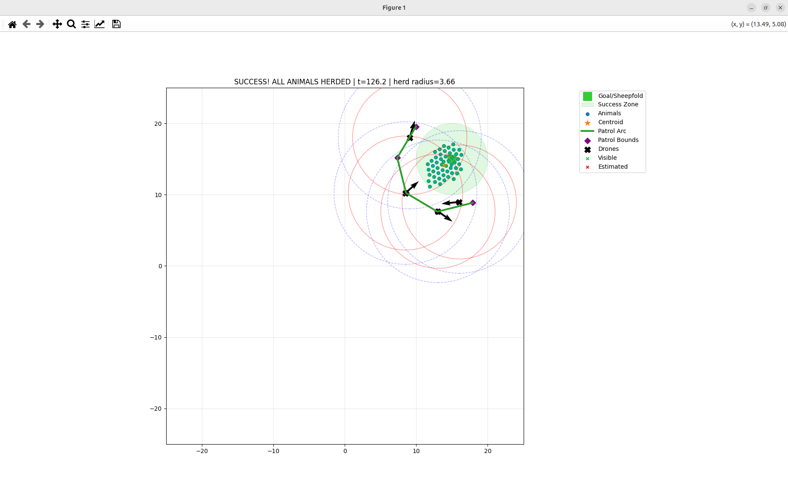

# Barking Drone

## Description

The goal of this project is to create a control algorithm for a swarm of drones for the purpose of livestock herding. The project is based on the paper [Robotic Herding of Farm Animals Using a Network of Barking Aerial Drones](https://www.mdpi.com/2504-446X/6/2/29). 





## System

Cow behavior is modeled using Reynolds' rules of flocking behavior. The drones operate in two modes: 
1. **Gathering mode:** Drones navigate alongside a complex polygon surrounding the dispersed animals to push the furthest outlier animals towards the center of the herd.
2. **Driving mode:** The polygon simplifies to a circle in order to push the aggregated herd to the target location.

The core control algorithm is Sliding Mode Control (SMC), utilizing geometric switching logic. 

## Inputs and Outputs

The inputs to the plant (simulation) consist of:

- Linear drone velocity $v(t)$, where $v(t) \in [0, V_{max}]$
- Angular steering command $u(t)$, where $|u(t)| \le U_{max}$

The outputs of the plant (which serve as feedback to the controller) are:

- Drone Cartesian coordinates $d(t) = [x(t), y(t)]$
- Drone heading direction vector $a(t)$
- 2D cow positions (specifically the vertices of the herd's convex hull)
- Centroid of the herd $C_o$

---

## Usage

### Setup

```bash
cd tswr_project
python3 -m venv .venv
source .venv/bin/activate
pip install -r requirements.txt
```

### 1. Launch the standard simulation

Runs the full SMC herding simulation with hand-tuned gains ($k_{edge}=1$, $k_{target}=1$, $v_{scale}=1$) and live Matplotlib visualization:

```bash
python3 main_swarm_sim.py
```

- 50 animals, 4 drones, gathering → driving phases
- Goal at $(15, 15)$, success radius $5$
- Simulation runs up to 2500 steps (250 s simulated time, ~15 s wall-clock)
- Closing the plot window terminates the simulation early

### 2. Train the RL swarm controller

Trains a PPO policy to output fine-grained, per-drone residual steering and speed corrections (`delta_steer`, `delta_speed`) on top of the baseline SMC controller, rather than tuning global SMC gains.

```bash
# Full training (10M timesteps)
python3 herding_rl/train.py

# Quick test run (10k timesteps, ~1 minute)
python3 herding_rl/train.py --timesteps 10000

# Resume from checkpoint
python3 herding_rl/train.py --resume models/herding_rl/commander_ppo_100000_steps
```

**Reward Structure:** The agent is trained using a potential-based reward function that optimizes:
- **Progress:** Centroid movement toward the goal (boosted during driving).
- **Compactness:** Reduction in herd radius (boosted during gathering).
- **Stragglers:** Reduction of the distance of the furthest animal to the centroid.
- **Partial Success:** Quadratic scaling of the fraction of the herd inside the goal.
- **Coverage:** Angular spread of the drones around the herd centroid.
- **Action Cost:** Penalization of large residual command deviations.

Monitor progress with TensorBoard:
```bash
tensorboard --logdir logs/herding_rl/
```
Watch the success rate (`episode/success_rate`) and mean reward components (`rollout/mean_r_progress`, etc.) to track training progress.

### 3. Compare RL and SMC Baseline

Evaluate the trained RL agent against the pure SMC baseline by generating comparative videos under the exact same environment seeds:

```bash
# Generate side-by-side comparison videos
python3 generate_comparison_videos.py --seed 4
```

- Comparative simulations are recorded and saved directly to the `videos/` folder:
  - `videos/trained_rl.mp4`: Simulation run using the trained RL agent corrections.
  - `videos/no_rl.mp4`: Simulation run using only the SMC baseline controller.
- You can also run the utility script to print a summary of logged metrics from TensorBoard event files:
  ```bash
  python3 read_tb.py
  ```


## Project Structure

```
tswr_project/
├── main_swarm_sim.py          # Standard simulation entry point
├── animals.py                 # Herd dynamics & animal profiles
├── generate_comparison_videos.py # Evaluation & side-by-side rendering script
├── read_tb.py                 # Helper to read/print TensorBoard log summaries
├── requirements.txt
├── control/
│   ├── control_law.py         # SMC logic (with deadlock prevention / turn back logic)
│   ├── drone.py               # Drone dynamics (heading, position, speed)
│   ├── swarm_control.py       # 1D projection & target assignment
│   ├── swarm_manager.py       # Orchestrates drones in gathering/driving modes (separates computation and application of commands)
│   └── test_pilot.py
├── herding_rl/
│   ├── config.py              # Environment, Reward, and Train configurations (10M timesteps, 15 animals, 4 drones)
│   ├── gains_env.py           # Gymnasium environment (residual drone steering & speed corrections)
│   └── train.py               # PPO training loop with herding-specific metrics logging
├── models/herding_rl/         # Saved PPO checkpoints & VecNormalize statistics
├── logs/herding_rl/           # TensorBoard event logs
└── videos/                    # Comparison video recordings
```

