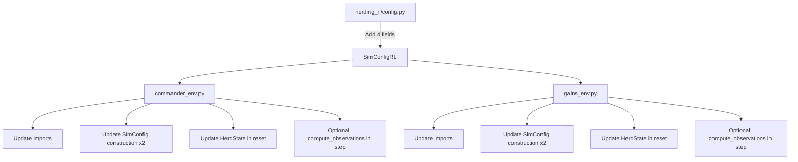

# RL Environment Integration Plan: `animals-model` Branch

## Problem Statement

The [`origin/animals-model`](../) branch introduces significant changes to [`main_swarm_sim.py`](../main_swarm_sim.py):
- `HerdState` now requires `panic_timers` and `panic_directions` fields
- `AnimalProfile` now requires `panic_probability`, `panic_duration_min`, `panic_duration_max`, `panic_strength`
- `SimConfig` now requires `accel_threshold`, `velocity_damping`, `drone_vision_radius`
- New functions: `compute_observations()`, `deterministic_update()`, `limit_speed_single()`
- `update_herd()` signature unchanged but now expects `HerdState` with panic fields

The two RL environments ([`commander_env.py`](../herding_rl/commander_env.py) and [`gains_env.py`](../herding_rl/gains_env.py)) import from `main_swarm_sim` and construct `HerdState`, `SimConfig`, and reference `AnimalProfile` — all of which will break after the merge.

---

## Files Requiring Changes

| File | Change Type | Impact |
|------|-------------|--------|
| [`herding_rl/commander_env.py`](../herding_rl/commander_env.py) | Update imports, `HerdState` construction, `SimConfig` construction | **Breaking** |
| [`herding_rl/gains_env.py`](../herding_rl/gains_env.py) | Update imports, `HerdState` construction, `SimConfig` construction | **Breaking** |
| [`herding_rl/config.py`](../herding_rl/config.py) | Add new fields to `SimConfigRL` | **Optional** (see migration flags) |
| [`herding_rl/train.py`](../herding_rl/train.py) | No changes needed | None |
| [`herding_rl/evaluate.py`](../herding_rl/evaluate.py) | No changes needed | None |

---

## Step-by-Step Changes

### Step 1: Update `SimConfigRL` in [`herding_rl/config.py`](../herding_rl/config.py)

Add the three new fields to [`SimConfigRL`](../herding_rl/config.py:6) so the RL config stays in sync with the simulation config:

```python
@dataclass
class SimConfigRL:
    # ... existing fields ...
    accel_threshold: float = 0.15
    velocity_damping: float = 0.95
    drone_vision_radius: float = 10.0
```

**Rationale:** The RL envs already use `SimConfigRL` to build `SimConfig`. Adding these fields keeps the RL config self-contained and avoids hardcoding magic numbers.

---

### Step 2: Update `commander_env.py` — Imports

**File:** [`herding_rl/commander_env.py`](../herding_rl/commander_env.py)

**Current import (line 10-13):**
```python
from main_swarm_sim import (
    SimConfig, HerdState, AnimalProfile, ANIMAL_PROFILES,
    update_herd, compute_centroid, herd_radius, find_furthest_animal_from_centroid
)
```

**New import — add `compute_observations`:**
```python
from main_swarm_sim import (
    SimConfig, HerdState, AnimalProfile, ANIMAL_PROFILES,
    update_herd, compute_centroid, herd_radius, find_furthest_animal_from_centroid,
    compute_observations,
)
```

---

### Step 3: Update `commander_env.py` — `SimConfig` construction

**File:** [`herding_rl/commander_env.py`](../herding_rl/commander_env.py)

**Current (lines 48-55):**
```python
self._sim_cfg_for_herd = SimConfig(
    n_animals=self.env_cfg.n_animals,
    n_drones=self.env_cfg.n_drones,
    dt=self.env_cfg.dt,
    world_min=self.sim_cfg.world_min,
    world_max=self.sim_cfg.world_max,
    drone_influence_radius=self.sim_cfg.drone_influence_radius,
)
```

**New — add the three new fields:**
```python
self._sim_cfg_for_herd = SimConfig(
    n_animals=self.env_cfg.n_animals,
    n_drones=self.env_cfg.n_drones,
    dt=self.env_cfg.dt,
    world_min=self.sim_cfg.world_min,
    world_max=self.sim_cfg.world_max,
    drone_influence_radius=self.sim_cfg.drone_influence_radius,
    accel_threshold=self.sim_cfg.accel_threshold,
    velocity_damping=self.sim_cfg.velocity_damping,
    drone_vision_radius=self.sim_cfg.drone_vision_radius,
)
```

**Same change required in `set_curriculum()` (lines 73-80).**

---

### Step 4: Update `commander_env.py` — `HerdState` construction in `reset()`

**File:** [`herding_rl/commander_env.py`](../herding_rl/commander_env.py)

**Current (line 140):**
```python
self.herd = HerdState(positions=positions, velocities=velocities)
```

**New — add panic fields:**
```python
panic_timers = np.zeros(n, dtype=int)
panic_directions = np.zeros((n, 2), dtype=float)
self.herd = HerdState(
    positions=positions,
    velocities=velocities,
    panic_timers=panic_timers,
    panic_directions=panic_directions,
)
```

---

### Step 5: Update `commander_env.py` — Add observation estimation (optional)

The `animals-model` branch adds partial observability via `compute_observations()`. The RL env can optionally use this after each `update_herd()` call in `step()`.

**In `step()` (after line 200, after `update_herd`):**
```python
# Optional: apply partial observability estimation
if self.sim_cfg.use_partial_observability:
    self.herd.positions, self.herd.velocities, _ = compute_observations(
        self.herd, self.swarm_manager.drones,
        self._sim_cfg_for_herd, self.profile,
        # prev_positions and prev_velocities would need to be tracked
    )
```

This requires adding `use_partial_observability: bool = False` to `SimConfigRL` — see migration flags below.

---

### Step 6: Apply same changes to `gains_env.py`

**File:** [`herding_rl/gains_env.py`](../herding_rl/gains_env.py)

All the same changes from Steps 2–5 apply identically to `gains_env.py`:

| Location | Change |
|----------|--------|
| Line 9-13 (imports) | Add `compute_observations` to import |
| Lines 38-45 (`SimConfig` in `__init__`) | Add `accel_threshold`, `velocity_damping`, `drone_vision_radius` |
| Lines 65-72 (`SimConfig` in `set_curriculum`) | Same as above |
| Line 128 (`HerdState` in `reset`) | Add `panic_timers`, `panic_directions` |
| After `update_herd` in `step()` | Optional `compute_observations` call |

---

## Migration Flags / Backward Compatibility

To keep the RL environments working with **both** the old and new `main_swarm_sim.py` (before and after the `animals-model` merge), add a compatibility flag to [`SimConfigRL`](../herding_rl/config.py:6):

```python
@dataclass
class SimConfigRL:
    # ... existing fields ...
    accel_threshold: float = 0.15
    velocity_damping: float = 0.95
    drone_vision_radius: float = 10.0
    use_partial_observability: bool = False   # <-- NEW flag
```

When `use_partial_observability=False` (default), the envs skip the `compute_observations()` call and behave as before (full observability). When `True`, they apply the estimation model.

**No separate wrapper or adapter is needed** — the changes are minimal enough to inline directly. The `HerdState` and `SimConfig` changes are **mandatory** (they'll crash without the new fields), but the observation estimation is **optional** and gated by the flag.

---

## Summary of All Edits



### Exact function/method signatures to update

| File | Function/Method | Lines | Change |
|------|----------------|-------|--------|
| `config.py` | `SimConfigRL` | 6-18 | Add 4 fields |
| `commander_env.py` | Module imports | 10-13 | Add `compute_observations` |
| `commander_env.py` | `__init__` | 48-55 | Add 3 SimConfig fields |
| `commander_env.py` | `set_curriculum` | 73-80 | Add 3 SimConfig fields |
| `commander_env.py` | `reset` | 140 | Add panic fields to HerdState |
| `commander_env.py` | `step` | ~200 | Optional compute_observations |
| `gains_env.py` | Module imports | 9-13 | Add `compute_observations` |
| `gains_env.py` | `__init__` | 38-45 | Add 3 SimConfig fields |
| `gains_env.py` | `set_curriculum` | 65-72 | Add 3 SimConfig fields |
| `gains_env.py` | `reset` | 128 | Add panic fields to HerdState |
| `gains_env.py` | `step` | ~191 | Optional compute_observations |

### No changes needed
- [`train.py`](../herding_rl/train.py) — uses `HerdingGainTunerEnv()` factory, no direct imports from `main_swarm_sim`
- [`evaluate.py`](../herding_rl/evaluate.py) — same, only accesses env attributes at runtime
- [`control/swarm_manager.py`](../control/swarm_manager.py) — already accepts `gains` tuples, no changes needed
